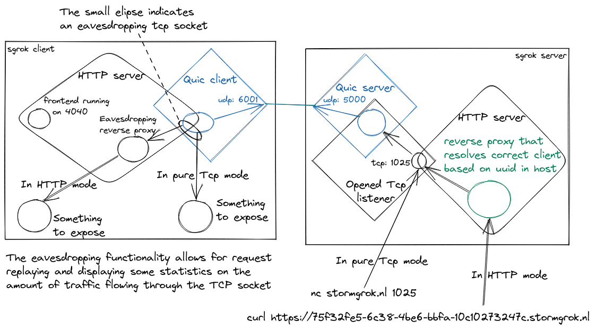

# storm_grok
Homegrown ngrok clone, written in rust!

## Architecture

The client contains a small bundled frontend so there are three components in this repo, server, client and frontend. The frontend is bundled in the client by using a crate called [include_dir](https://docs.rs/include_dir/latest/include_dir/). The architecture diagram here tries to explain the flow of traffic when running sgrok in http or tcp mode.


## Development

Before the storm_grok client can run you need to build the frontend. It's a small wasm app made using sycamore.

``` bash
cargo install trunk
rustup target add wasm32-unknown-unknown

cd frontend
RUSTFLAGS="" trunk build [--release]
```

This preps 3 files in a directory called 'dist' which are used when running the client, running the server and client is done from the root of the repo like so:

``` bash
cargo run --bin sg_server
cargo run --bin storm_grok http 4040 [-d]
```

The optional `-d` flag on the client is for running in development mode. Without this flag the client will try to connect to `stormgrok.nl` at `157.90.124.255`. These values are hardcoded for now. With the `-d` flag set it will instead try to connect to `localhost` at `127.0.0.1`.

For building releases run `make`, this will create a release for the server called `sg_server` and one for the client called `storm_grok` in the directory: `target/release`.
